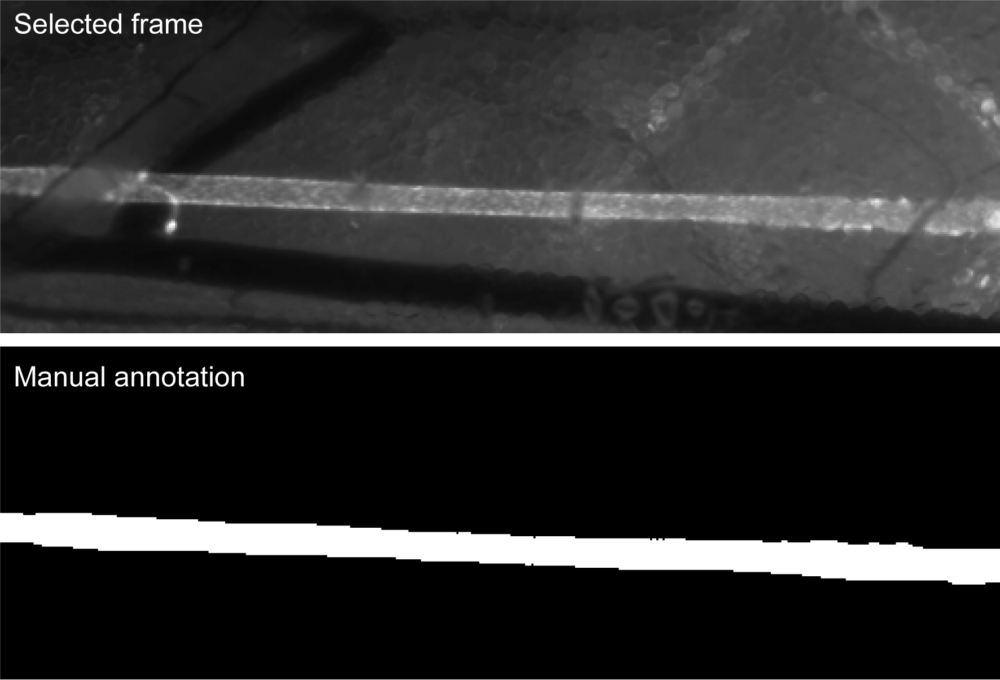
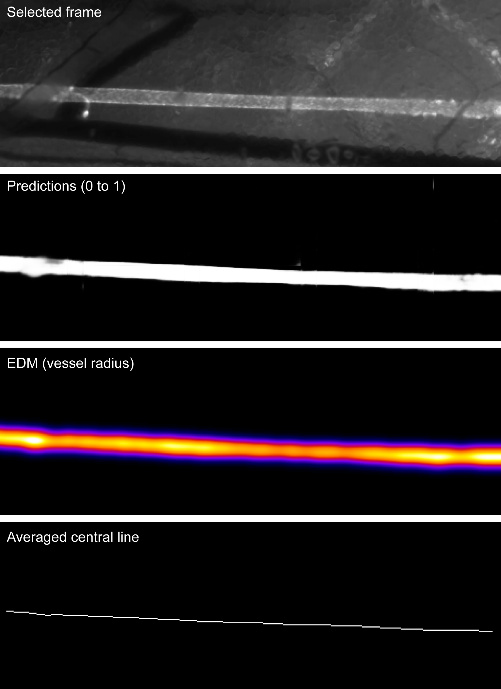
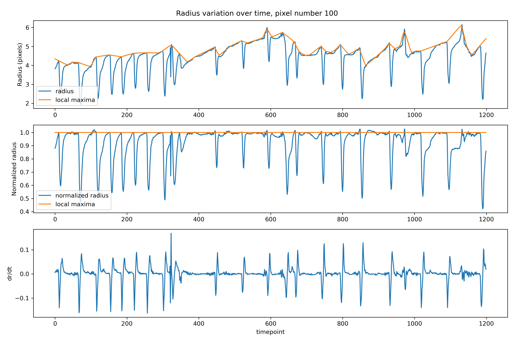

# ETH-ScopeM_Gkountidi

## Contact
benoit.dehapiot@scopem.ethz.ch  

## Overview

Measure lymphatic vessel contractions before and after control or inhibitor injection.

## Procedure

We first segment the lymphatic vessels using a custom-trained U-Net network and then monitor vessel contractions by measuring their radius variation over time. Deep-learning segmentation was necessary t

### 1. Lymphatic vessel segmentation

#### 1.1 Format training data 

`extract.py`  

- Open and convert `.avi` movies to `ndarray`
- Ramdomly select n frames in each movies
- Save selected frames as `.tif` files in the `data/train` folder as   
`[movie_name]_[frame_number].tif`

#### 1.2 Annotate training data

`annotate.py`  

- Sequentially open saved frames in `Napari` viewer
- Annotate vessels using the label brush tool
- Save annotated masks as `.tif` files in the `data/train` folder as
`[movie_name]_[frame_number]_mask.tif`

#### 1.3 Prepare data and train U-Net model

`train.py`  

- Open selected frames and associated masks
- Reduce image resolution 
- Normalize images (0 to 1)  
- Data augmentation (flip, rotate, distord...)
- Setup U-Net architecture and parameters (epoch, batch size, loss...)
- Train the network and save weights as `model_weights.h5`

### 2. Measure local vessel contraction

`analyse.py`

#### 2.1 Prepare data and predict

- Open and convert `.avi` movies to `ndarray`
- Reduce image resolution 
- Normalize images (0 to 1)  
- Get predictions for all frames

#### 2.2 Processing

- Spatial registration
- Prediction masks (prediction > 0.5)
- Compute euclidean distance map (vessel radius)
- Get central line (skeletonize time-averaged prediction mask)

#### 2.3 Analysis

- Get temporal radius variation for each pixel of the central line 
- Normalize radius variation by local maxima 
- Analyse derivative of normalized radius variation

